# THABAT — System Architecture Map
**For technical partners: TechVirtis / Elias**
*Phase 01–09 · Feature/sales-intelligence-p2*

---

## Full System Graph

```mermaid
graph TD
    %% ── App Shell ──────────────────────────────────────────────────────────
    subgraph Shell["App Shell · Next.js 16 App Router"]
        Layout["[locale]/layout.tsx\nThemeProvider · AuthProvider\nEntityProvider · NextIntlClientProvider"]
        NavBar["NavigationBar.tsx"]
        Header["AppHeader.tsx"]
    end

    %% ── Phase 09: Multi-Entity Governance ──────────────────────────────────
    subgraph P09["Phase 09 — SovereignSilo"]
        EC["EntityContext.tsx\n(React Context)"]
        EL["entityContext.ts\n(pure lib)"]
        ES["EntitySelector.tsx\nGlassmorphic switcher\n+ health score per entity"]
        SB["Sovereign Badge\nin OracleBriefing"]
        NS[("Namespaced Storage\nthabat-ent_01-ledger\nthabat-ent_02-ledger\nthabat-ent_03-ledger")]
    end

    %% ── Home Screen ─────────────────────────────────────────────────────────
    subgraph Home["Home Screen — RitualScreen.tsx"]
        Ring["StabilityRing.tsx\n(P01)"]
        Oracle["OracleBriefing.tsx\n(P06) + Sovereign Badge (P09)"]
        Drivers["DriverCard.tsx × 4\n(P01)"]
        SAR["StockHourglass.tsx\n(P04)"]
        Ledger["ActionLedger.tsx\n(P05–P08)"]
        Scenario["ScenarioPlayground.tsx\n(P07)"]
        Opt["OptimizerWidget.tsx\n(P08)"]
        Export["ExportPortal.tsx\n(P09)"]
    end

    %% ── Analytics Routes ────────────────────────────────────────────────────
    subgraph Analytics["Analytics · /[locale]/analytics/*"]
        Nitaqat["nitaqat/\nNitaqatShield · compliance"]
        SalesRep["sales-report/"]
        ReceivRep["receivables-report/"]
        EffRep["efficiency-report/"]
        SupplyChain["supply-chain/\nSupplierCard · SupplyChainChart"]
        Approvals["approvals/"]
    end

    %% ── Investor Route ──────────────────────────────────────────────────────
    subgraph Investor["Investor View · /[locale]/investor"]
        IV["InvestorView.tsx\nRead-only · score band\nverified strategies"]
    end

    %% ── Data / Logic Layer ──────────────────────────────────────────────────
    subgraph DataLayer["Data & Logic · src/lib/"]
        Scoring["scoring.ts\nConsequenceInsight\nScoreBreakdown"]
        Ledger2["ledger.ts\nLedgerEntry · CRUD\nentity-namespaced keys"]
        Nitaqat2["nitaqat.ts\nmaxExpatsBeforeDrop\ncalcNitaqatTier"]
        StockGap["stockGap.ts\ncalculateStockGap"]
        ScenarioLib["projectScenarioImpact.ts\n3-lever projection engine"]
        Pathfinder["findOptimalPath.ts\nbalanced/maxGrowth/maxProfit"]
        Briefing["generateBriefing.ts\nOracleContext resolver"]
        BoardReport["generateBoardReport.ts\n30-day aggregator"]
        EntityLib["entityContext.ts\ngetLedgerStorageKey\nDEMO_ENTITIES"]
    end

    %% ── API Routes ──────────────────────────────────────────────────────────
    subgraph API["API · src/app/api/"]
        MetricsAPI["metrics/route.ts"]
        AuthAPI["auth/{login,signup,me}/"]
        PilotAPI["pilot/kpis/route.ts"]
        IntAPI["integrations/route.ts"]
        ConsolAPI["metrics/consolidated/route.ts"]
    end

    %% ── Storage ─────────────────────────────────────────────────────────────
    subgraph Storage["Storage"]
        LS[("localStorage\n(entity-namespaced ledger\ntheme · active-entity)")]
        DB[("Turso / LibSQL\nScores · Metrics\nOrgs · Users")]
    end

    %% ── Connections ─────────────────────────────────────────────────────────

    Layout --> EC
    Layout --> NavBar
    Layout --> Header

    EC --> EL
    EC --> ES
    EC --> SB
    EL --> NS
    EL --> Ledger2

    Home --> Ring
    Home --> Oracle
    Home --> Drivers
    Home --> SAR
    Home --> Scenario
    Home --> Export

    Oracle --> SB
    Oracle --> Briefing

    Scenario --> ScenarioLib
    Scenario --> Opt
    Opt --> Pathfinder

    Export --> BoardReport
    Export --> IV

    Nitaqat --> Nitaqat2
    SupplyChain --> StockGap

    BoardReport --> Ledger2
    Briefing --> Ledger2
    Ledger2 --> LS
    Ledger2 --> NS

    MetricsAPI --> DB
    AuthAPI --> DB
    Home --> MetricsAPI
    Home --> Scoring
```

---

## Storage Namespacing

| Key | Owner | Purpose |
|-----|-------|---------|
| `thabat-active-entity` | entityContext.ts | Currently selected entity ID |
| `thabat-ent_01-ledger` | ledger.ts | PAC Technologies action log |
| `thabat-ent_02-ledger` | ledger.ts | Al-Noor Medical action log |
| `thabat-ent_03-ledger` | ledger.ts | Salam Logistics action log |
| `thabat-theme` | ThemeContext.tsx | `'light'` \| `'dark'` |

---

## Phase Index

| Phase | Name | Key Files |
|-------|------|-----------|
| P01 | Stability Engine | `scoring.ts` · `StabilityRing` · `DriverCard` |
| P02 | Auth + Onboarding | `auth/login` · `auth/signup` · `Onboarding` |
| P03 | Analytics Suite | `analytics/*` pages |
| P04 | Stock-at-Risk | `stockGap.ts` · `StockHourglass` |
| P05 | Resilience Ledger | `ledger.ts` · `ActionLedger` · `SupplierCard` |
| P06 | ExecutiveOracle | `generateBriefing.ts` · `OracleBriefing` |
| P07 | ScenarioEngine | `projectScenarioImpact.ts` · `ScenarioPlayground` |
| P08 | Pathfinder Optimizer | `findOptimalPath.ts` · `OptimizerWidget` |
| P09 | CapitalReporter + SovereignSilo | `generateBoardReport.ts` · `ExportPortal` · `InvestorView` · `EntitySelector` |

---

## Event Bus (Custom DOM Events)

| Event | Dispatcher | Consumers |
|-------|------------|-----------|
| `thabat-ledger-updated` | `ledger.ts::saveLedger` | `ActionLedger`, `OracleBriefing`, `RitualScreen` (totalAvoided) |
| `thabat-entity-changed` | `entityContext.ts::setActiveEntityId` | `EntityContext` (re-syncs active entity state) |
| `storage` (native) | Browser cross-tab | `ActionLedger` |

---

*Generated by THABAT Stability Intelligence — CONFIDENTIAL*
